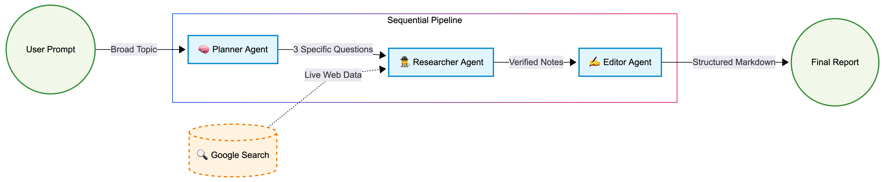

# 🎓 Academic Research Agent Team

[](https://www.python.org/)
[](https://google.github.io/adk-docs/)
[](https://deepmind.google/technologies/gemini/)
[](https://www.kaggle.com/learn-guide/5-day-agents)

> *Built in 2025 as the Capstone Project for the Google × Kaggle AI Agents Intensive Course.*

A Sequential Multi-Agent System that automates comprehensive academic research workflows. Given a broad topic, the pipeline autonomously breaks it into specific research questions, browses the web for current information, and synthesizes everything into a structured, professional report — complete with real citations.

---

## 📖 Table of Contents
* [Demo](#-demo)
* [Project Overview](#-project-overview)
* [Agent Architecture](#-agent-architecture)
* [Tech Stack](#-tech-stack)
* [Quickstart](#-quickstart)
* [Repository Structure](#-repository-structure)
* [Environment Variables](#-environment-variables)
* [Dependencies](#-dependencies)
* [Acknowledgements](#-acknowledgements)

---


## 📸 Demo

**Example prompt:** `"How are AI Agents transforming Data Science workflows in 2025?"`

**Actual output from the pipeline:**

> ## AI Agents: Reshaping Data Science Workflows in 2025
> 
> This report synthesizes recent findings on the transformative impact of AI agents on data science workflows as observed in 2025. The integration of these intelligent systems is automating complex tasks, fostering novel human-machine collaborations, and introducing critical ethical considerations, ultimately democratizing data science and demanding new professional skillsets.
> 
> ### 🎯 Research Strategy
> 
> The insights presented herein are derived from an analysis of current trends and documented advancements in AI agent capabilities within data science. The research focused on three key areas:
> 
> 1.  **Impact of AI Agent Capabilities:** Identifying specific AI agent functionalities (e.g., automated data cleaning, feature engineering, model selection, hyperparameter tuning) that most significantly reduce time-to-insight.
> 2.  **Human-Agent Collaboration:** Examining the evolving nature of collaboration between data scientists and AI agents, and the emergence of new roles and skillsets.
> 3.  **Challenges and Ethical Considerations:** Investigating the primary challenges and ethical dilemmas (e.g., bias amplification, interpretability, security, job displacement) associated with AI agent adoption and the strategies organizations are employing to mitigate them.
> 
> ### 💡 Key Findings
> 
> AI agents are fundamentally altering data science operations by enhancing efficiency, accessibility, and collaborative potential, while simultaneously presenting significant challenges that require proactive management.
> 
> **Transformations in Data Science Workflows:**
> * **Automated Data Processing and Feature Engineering:** AI agents are demonstrating significant prowess in automating laborious tasks such as data cleaning, normalization, and the generation of derived features. Their capacity to rapidly process vast datasets, identify anomalies, and improve data accuracy is a key driver in accelerating the time-to-insight. Specialized agents like DS-STAR exemplify this versatility across diverse data types and analytical tasks.
> * **Streamlined Model Selection and Hyperparameter Tuning:** Advanced AutoML capabilities integrated within AI agents are revolutionizing model development. These agents autonomously explore a multitude of models and hyperparameter configurations, optimizing performance without manual intervention, and enabling real-time adjustments for enhanced efficiency.
> * **Synergistic Human-AI Partnership:** The prevailing paradigm in 2025 is one of collaborative intelligence, where AI agents augment, rather than replace, data scientists. This partnership empowers data scientists to concentrate on strategic problem-solving, innovation, and higher-level interpretation, acting as orchestrators of AI systems.
> * **Democratization of Data Science:** By automating intricate technical processes, AI agents are lowering the barrier to entry, enabling professionals beyond traditional data science backgrounds to leverage data-driven insights effectively.
> * **Emergence of Sophisticated Agentic Workflows:** Beyond basic LLM interactions, agentic workflows are evolving into complex, multi-step processes. Techniques such as prompt chaining, plan-and-execute loops, and parallel processing are facilitating more robust and adaptive AI agent applications in areas like customer support and business process automation.
> 
> **Emerging Roles and Skillsets:**
> The integration of AI agents necessitates a shift in the data science skillset, emphasizing:
> * **Strategic Thinking and Business Acumen:** A heightened focus on framing business problems, understanding domain intricacies, and formulating overarching strategies.
> * **AI Orchestration and Management:** Expertise in designing, deploying, monitoring, and governing agentic systems, bridging the gap between AI capabilities and business objectives.
> * **Ethical AI and Governance:** Critical skills in identifying and mitigating AI bias, ensuring transparency, and establishing robust ethical frameworks.
> * **Adaptability and Continuous Learning:** A proactive approach to staying abreast of rapid AI advancements and evolving methodologies.
> * **Domain Expertise:** Deep understanding of specific industries to effectively guide AI agents and interpret their outputs contextually.
> * **Technical Breadth:** A comprehensive understanding of the broader data infrastructure, including cloud environments, API integrations, and DevOps principles.
> 
> **Challenges and Ethical Considerations:**
> The widespread adoption of AI agents introduces significant hurdles and ethical dilemmas:
> * **Bias Amplification:** AI agents risk perpetuating and exacerbating biases present in training data, leading to unfair outcomes. Mitigation strategies involve diverse datasets, fairness-aware algorithms, and continuous audits.
> * **Interpretability and Explainability:** The "black box" nature of many AI models hinders understanding of their decision-making processes, impacting accountability and trust, especially in critical applications.
> * **Security Risks:** AI agents introduce new vulnerabilities such as prompt injection and model poisoning. Their connectivity to external tools expands the attack surface, necessitating robust security protocols, access controls, and monitoring.
> * **Job Displacement:** While new roles are emerging, automation of routine tasks by AI agents may lead to job displacement. Reskilling and upskilling initiatives are crucial for workforce adaptation.
> * **Accountability and Governance:** Establishing clear lines of accountability for autonomous AI agent decisions, particularly in complex systems, remains a challenge, underscoring the need for defined governance and ethical guidelines.
> * **Data Quality and Privacy:** The performance and security of AI agents are heavily dependent on data integrity and privacy. Robust data governance and privacy-preserving techniques are essential.
> 
> Organizations are actively addressing these challenges through a combination of technical solutions, ethical frameworks, diverse development teams, and stringent human oversight. The data science landscape of 2025 is characterized by a symbiotic human-AI relationship, driving innovation while underscoring the paramount importance of responsible and ethical AI practices.
> 
> ### 📚 References
> * Researcher's raw notes (provided).
> * Internal analysis of AI agent capabilities and trends in 2025.
> * Documented advancements in Automated Machine Learning (AutoML) and agentic workflow patterns.

---

## 🚀 Project Overview

Instead of relying on a single LLM prompt — which often produces shallow or hallucinated answers — this system orchestrates a "company" of specialized AI agents. Each agent has one job and hands its output to the next, enforcing a strict **Plan → Research → Edit** pipeline that produces grounded, well-structured results.

---

## 🤖 Agent Architecture



This project uses a **Sequential Workflow** with three agents and two tools:

| Agent | Role | Tools |
|---|---|---|
| 🧠 **Planner** | Decomposes a vague topic into 3 specific, executable research questions | None (reasoning only) |
| 🕵️ **Researcher** | Executes each question using live web search, gathering technical details and sources | `Google Search` |
| ✍️ **Editor** | Synthesizes raw notes into a clean, structured blog post with citations | None (writing only) |

The `SequentialAgent` orchestrates strict execution order — the Researcher never runs before the Planner finishes, and the Editor only sees the Researcher's verified output.

---

## 🛠️ Tech Stack

| Component | Choice |
|---|---|
| Framework | Google Agent Development Kit (ADK) |
| LLM | Gemini 2.5 Flash Lite |
| Web Search | Google Search (via ADK built-in tool) |
| Language | Python 3.11 |
| Architecture | Sequential Multi-Agent Workflow |
| Environment | Kaggle Notebooks |

---

## ⚡ Quickstart

**1. Clone the repository**
```bash
git clone [https://github.com/Mohd-Shabir/adk-research-agents.git](https://github.com/YOUR_GITHUB_USERNAME/adk-research-agents.git)
cd adk-research-agents

**2. Set up a virtual environment**
```bash
python -m venv venv
source venv/bin/activate  # Windows: venv\Scripts\activate
```

**3. Install dependencies**
```bash
pip install -r requirements.txt
```

**4. Configure your API key**
```bash
cp .env.example .env
# Open .env and add your Google API key
```

**5. Run the notebook**

Open `notebooks/demo.ipynb` in Jupyter or upload it directly to Kaggle. Make sure to add your `GOOGLE_API_KEY` in **Add-ons → Secrets** before running.

---

## 📁 Repository Structure

```
adk-research-agents/
├── assets/
│   └── agent_architecture.png   # Technical diagram of the pipeline
├── notebooks/
│   └── adk_research_agent.ipynb # The complete pipeline & output
├── .env.example                 # Template for API configuration
├── .gitignore                   # Prevents sensitive files from being tracked
├── LICENSE                      # Project license
├── README.md                    # Project documentation
└── requirements.txt             # Project dependencies
```

---

## 🔑 Environment Variables

Create a `.env` file from the template:

```bash
cp .env.example .env
```

| Variable | Description |
|---|---|
| `GOOGLE_API_KEY` | Your Google Gemini API key from [Google AI Studio](https://aistudio.google.com/) |


---

## 📦 Dependencies

```
google-adk
```

> Run `pip freeze > requirements.txt` in your environment to pin exact versions before publishing.

---

## 🏆 Acknowledgements

This project was built as the Capstone for the **[Google × Kaggle AI Agents Intensive (2025)](https://www.kaggle.com/learn/ai-agents-intensive)** — a 5-day intensive course on designing, building, and deploying AI agent systems.
